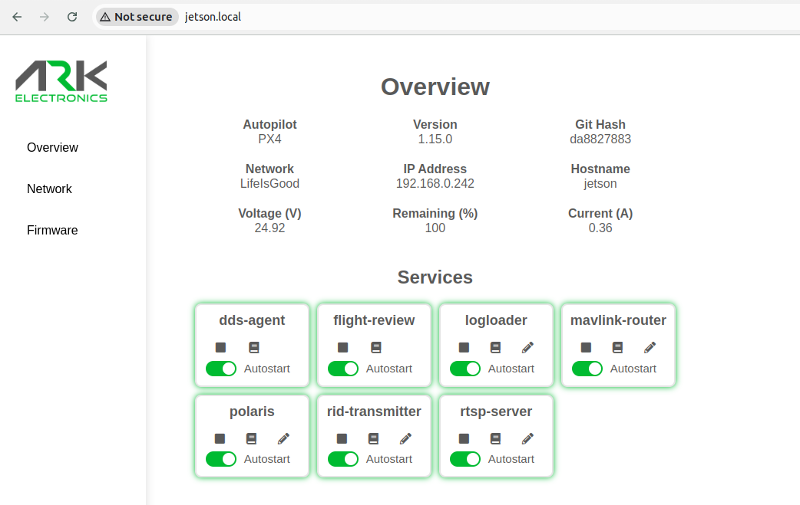

ARK-OS is a collection of software and tools for drones. These software packages provide essential features such as mavlink routing, video streaming, automatic flight log upload, flight controller firmware updating, network RTK corrections, and more.



# Getting started
Run the install script on the device. You will be prompted y/n to install the packages, you can press enter to skip and use the reccomended defaults.
```
./install.sh
```
You can skip the interactive prompt by copying the **default.env** file and renaming it **user.env**. You can adjust the options in the **user.env**.This script can be safely run multiple times to update your system.

#### Supported targets
- **ARK Jetson Carrier** <br> https://arkelectron.com/product/ark-jetson-pab-carrier/
- **ARK Pi6X Flow** <br> https://arkelectron.com/product/ark-pi6x-flow/


## Services
When running the **install.sh** script you will be prompted to install the below services. The services are installed as [systemd user services](https://www.unixsysadmin.com/systemd-user-services/) and conform to the [XDG Base Directory Specification](https://specifications.freedesktop.org/basedir-spec/latest/index.html).

## Jetson and Pi

**mavlink-router.service** <br>
This service enables mavlink-router to route mavlink packets from the Flight Controller USB port to user defined UDP endpoints. The **platform/`target`/main.conf** file defines these endpoints and is installed at **~/.local/share/mavlink-router/main.conf**. The **main.conf** can also be updated using the ARK UI service configuration editor.

**dds-agent.service** <br>
The dds-agent service bridges the PX4 uORB pub/sub system to ROS2 topics on the Pi. The bridged topics are defined in PX4 Firmware and can be [found here](https://github.com/PX4/PX4-Autopilot/blob/main/src/modules/uxrce_dds_client/dds_topics.yaml). The **dds-agent** runs the [micro-xrce-dds-agent](https://github.com/eProsima/Micro-XRCE-DDS-Agent) over the high speed serial connection between Flight Controller and Companion.

**logloader.service** <br>
This service downloads log files from the SD card of the flight controller via MAVLink and optionally uploads them to [PX4 Flight Review](https://review.px4.io/). <br>

**flight-review.service** <br>
This service hosts a local PX4 Flight Review server on port 5006. All logs downloaded with **logloader** are available here. <br>

**rtsp-server.service** <br>
This service provides an RTSP server via gstreamer **rtsp://`hostname`.local:8554/camera1** <br>

**polaris.service** <br>
This service receives RTCM corrections from the PointOne GNSS Corrections service and publishes them via MAVLink.

**ark-ui-backend.service** <br>
This service provides a REST API backend for ARK-UI. The ARK UI frontend is hosted using nginx at **`hostname`.local** and provides tools such as Flight Controller firmware updating, wifi configuration, log viewing, and more.

**hotspot-control.service** <br>
This service creates a hotspot after booting if the device is unable to auto connect to a network. You can then use the ARK UI to configure your network.

### Jetson only

**rid-transmitter.service** <br>
This service starts the RemoteIDTransmitter service which broadcasts RemoteID data via Bluetooth.

**jetson-can.service** <br>
This service enables the Jetson CAN interface.

**jetson-clocks.service** <br>
This service sets the Jetson clocks to their maximum rate.
